# Kumbu Connect

Kumbu Connect is a two-sided platform I’m building through Penn State’s Humanitarian Engineering and Social Entrepreneurship (HESE) program. The point is to help Kenyan community-based organizations get their records in one place, and to make it easier for funders to find and evaluate them.

A lot of CBOs already have evidence of the work they do. It’s just scattered — paper ledgers, reports, field forms, spreadsheets, photos, SMS from members. Kumbu is meant to turn that into an organizational profile a funder can actually read, while still being useful to the CBO as a day-to-day recordkeeping tool.

**1st place and $7,500 — Penn State’s 2026 Ag Springboard Competition.**

**Privacy:** names, money, messages, and organizational records in this public repo are mock or sanitized demo data. There is no private CBO, beneficiary, donor, or user information here.

## Highlights

- **CBO profiles:** Brings programs, impact, finances, milestones, community feedback, and funding needs into one organization profile.
- **Document digitization:** Uses Azure Document Intelligence and Gemini to structure paper records while flagging uncertain or inconsistent entries for review.
- **Funder marketplace:** Lets funders explore geographically placed CBOs through Google Maps, compare profiles, save organizations, and start conversations.
- **Plain-language search:** Matches a funder’s goals against information across CBO profiles and uploaded records, even when the wording differs.
- **Offline collection:** Keeps intake and bookkeeping work available with browser caching and syncs queued submissions when connectivity returns.

## Designing for different CBOs

Different CBOs show up with very different records. One has a formal report, another has handwritten cashbooks, and another works mostly from field forms, spreadsheets, or SMS. Funders still need enough shared structure to understand and compare the organizations without forcing every CBO through one giant form.

I designed Kumbu to translate those inputs into a semi-structured profile covering programs, leadership, impact, finances, milestones, community feedback, risks, and funding needs. The CBO gets a day-to-day workspace for its records, while the funder gets a marketplace for finding, comparing, saving, and contacting organizations.

The funder workflow and readiness scoring are still prototypes. We have not done enough testing with funders to claim that the current fields or scoring model match their real decisions, so validating those assumptions is one of the next steps.

## Product gallery

<table>
  <tr>
    <td>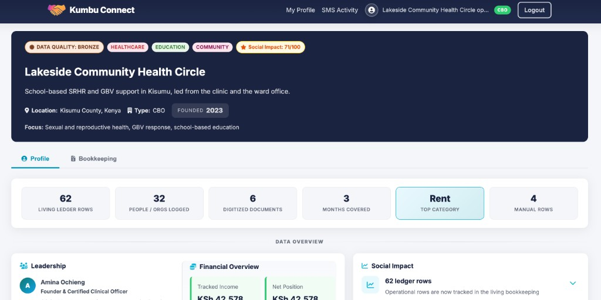</td>
    <td>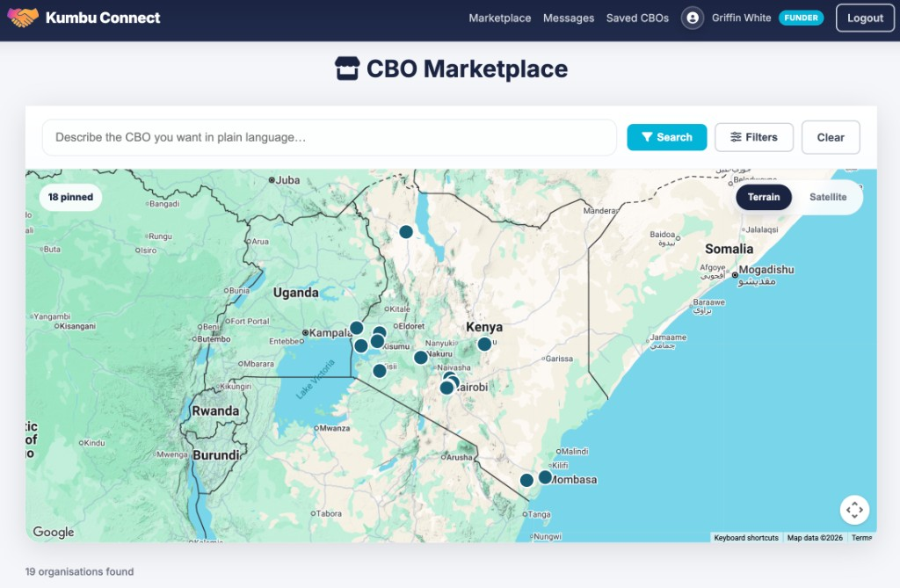</td>
  </tr>
  <tr>
    <td>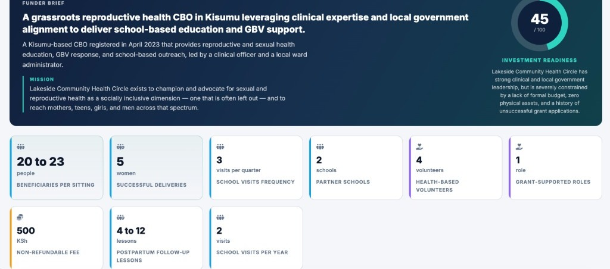</td>
    <td>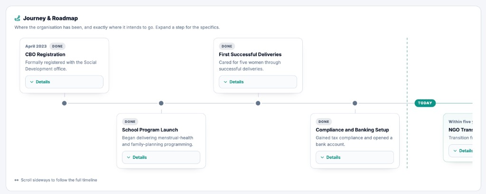</td>
  </tr>
  <tr>
    <td>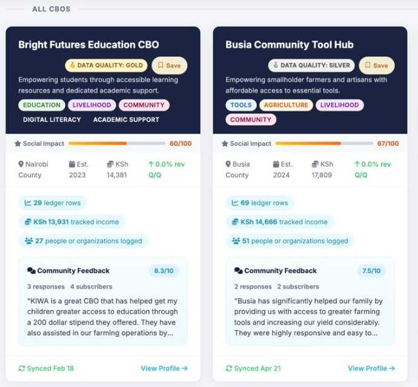</td>
    <td>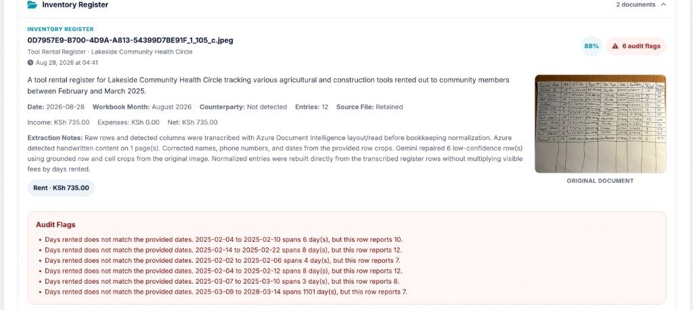</td>
  </tr>
  <tr>
    <td>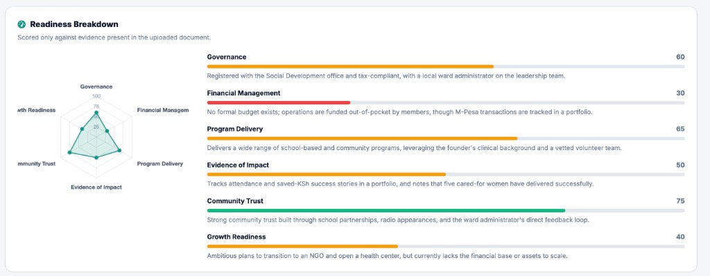</td>
    <td>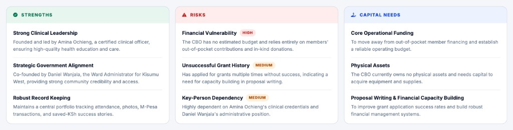</td>
  </tr>
  <tr>
    <td>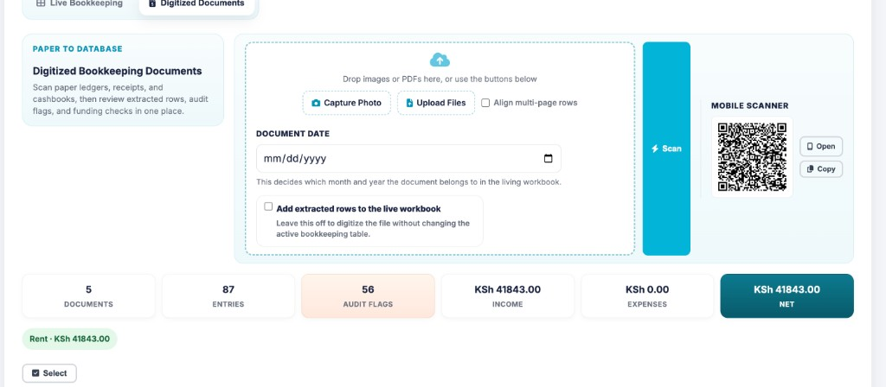</td>
    <td>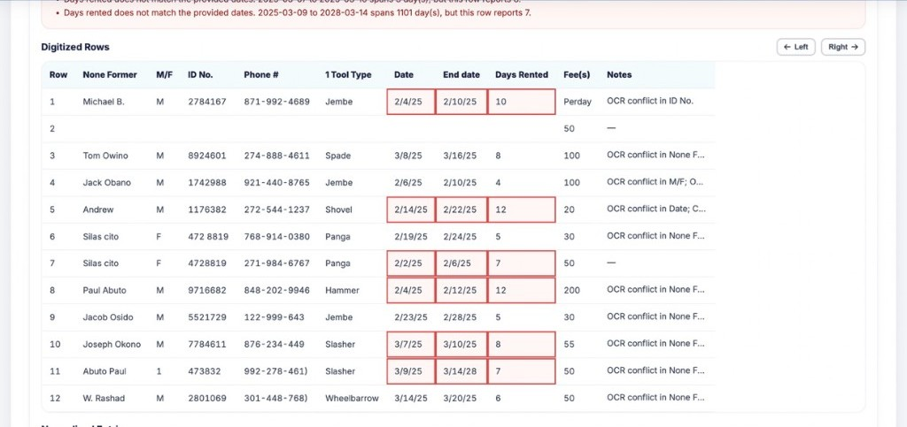</td>
  </tr>
  <tr>
    <td>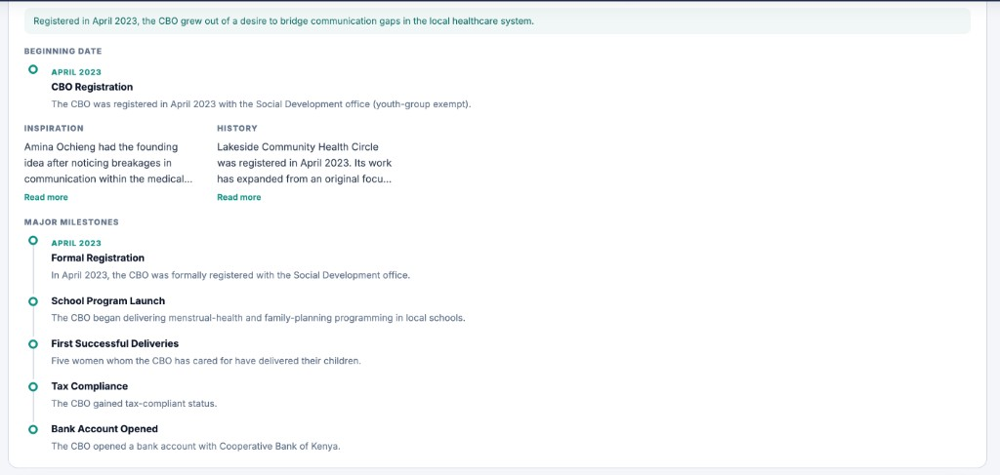</td>
    <td>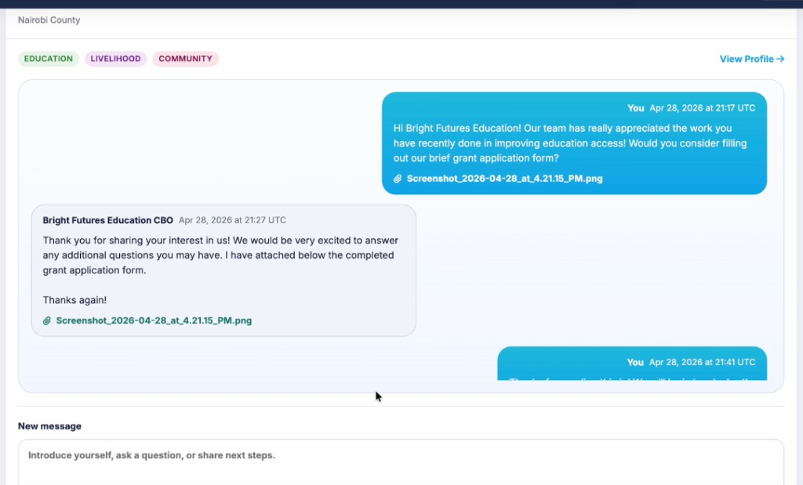</td>
  </tr>
</table>

## CBO marketplace and funder search

The marketplace places CBOs on Google Maps so funders can explore where organizations work instead of starting with a spreadsheet or list. Each result brings together the CBO’s location, programs, communities served, impact, financial history, and current funding needs.

Funders can also search in plain language for the kind of organization they want to support. The AI-assisted search uses the information across each CBO’s profile and uploaded records to find organizations that fit a specific funding target, even when the funder and CBO do not use the same exact wording. As the number and variety of CBOs grow, the map and search system are meant to reduce the time spent narrowing a large pool to the organizations worth reviewing more closely.

## From paper records to usable data

Financial records go through Azure Document Intelligence first so tables remain tables and rows remain rows. Gemini handles the harder leftovers, including messy handwriting, mixed languages, and half-readable cells, or acts as the fallback when Azure cannot process the page.

After extraction, an audit pass checks the data against itself. It flags date ranges that do not match reported rental days, daily rates that do not reproduce the written total, low-confidence cells, possible duplicates, and income or expense totals that do not add up. Kumbu preserves the original values and marks the disagreement for review instead of silently rewriting the CBO’s books.

Narrative reports follow a separate path that extracts programs, people, metrics, milestones, and risks. Extracted facts can fill missing profile fields, but they do not automatically overwrite information the CBO has already confirmed.

## Offline field collection

Connectivity can be unreliable in rural parts of Kenya, so I built the intake and bookkeeping tools to keep working after the page has loaded. A service worker caches the application shell, while IndexedDB stores form drafts, bookkeeping rows, and selected files in the browser. If a submission cannot reach the server, it stays in an outbox with its own submission ID and syncs when the connection returns instead of asking the user to start over.

The same workflow can be opened from a signed link or QR code on a phone. Google Forms, KoboToolbox, and Twilio SMS provide additional collection paths when a full browser workflow is not the best fit.

## Organizing CBO records

Each CBO has one profile that brings together its programs, impact, finances, documents, messages, and funding needs. The shared fields make organizations easier for funders to search and compare, while flexible sections leave room for CBOs that measure their work or keep records differently.

The deployed app uses Postgres, with SQLite for local development. Core records such as accounts, organizations, documents, and conversations stay consistently organized, while impact metrics, growth history, bookkeeping formats, and extracted facts can vary by CBO. Original uploads can stay in Firebase Storage, and selected bookkeeping and SMS data can be mirrored in Firestore.

## My role

I designed both sides of the product and the rules that connect them: which fields funders can compare, what a CBO should confirm by hand, how paper records become structured data, and which source wins when a scanned ledger, report, and intake response disagree. I use AI coding tools to help implement and test the product, but the main work has been making those data and workflow decisions.

**Stack:** Python, Flask, SQLAlchemy, Postgres / Cloud SQL, Firebase, Azure Document Intelligence, Gemini, OpenAI, Twilio, KoboToolbox, Google Maps and Forms, and Cloud Run.
